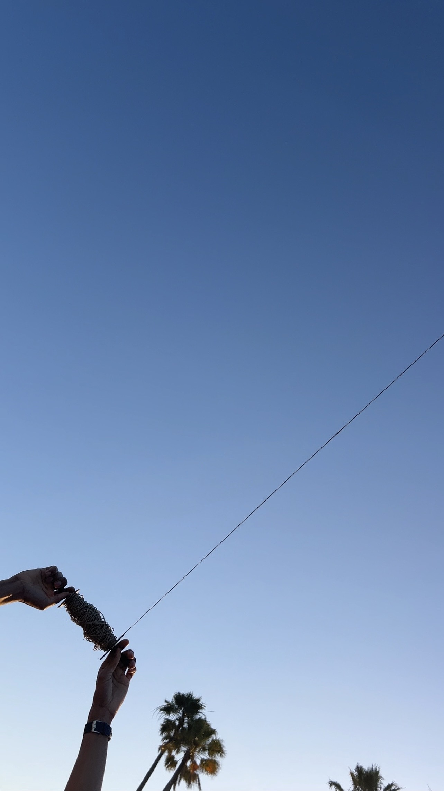

# Kite Node

Kite Node uses the magic of physics and engineering to quickly send LoRa devices (or anything else) soaring into the sky with the help of a steady breeze (and keep them there)!

Kite Node uses a handmade kite made from natural and repurposed materials, and is part of an ongoing art/research project. Currently the focus is on the engineering/design/prototyping part of things. Kite Node is a blank canvas for expressing many different artistic and design languages!

It's a place-based tool that teaches communities decentralized communication skills they can use right where they're at. 
 

   
  

# Advantages of DIY Kite Design
 **Kite Node uses a hadmade kite, constructed with natural, and repurposed materials, like sticks, trashbags and hemp twine**
 - **lifts devices with no electricity**
 - once airborne in windy areas, kites can fly for hours, **or even days** , continuously
- **simple, replicable design**
- **made of readily accessible, natural and recycled materials**

### Rokkaku Kite Design
This iteration of Kite Node is based on a **Japanese rokkaku design** with a traditional hexagonal shape
- **extremely stable in variety of conditions with no tail**
- can be tethered and left to **fly on it's own for extended periods of time**
- **3 piece frame,** and different materials can be swapped out
-  adjustable **4 point bridle**
- **self measuring:** all of the parts can be measured with string, as ratios of the length of the central beam
- rokkaku kites are commonly used in **kite aerial photography** because of their **ability to gently lift equipment** into the sky, and hold a stable position

### So the idea is that, if there's wind, you can look around yourself and find three sticks, a sail, and some string to lift a LoRa device high into the air to greatly increase it's range. 
### You can then leave the Kite Node airborne while you send/receive messages, before reeling it in 

# Place-Based
- Kite Node is especially suitable for coastal areas that get reliable wind
- could also be used on boats
- also works tethered to a rooftop, treetop or mast 
- creates the most advantage in a flat terrain, but really anywhere with good wind

### **For example:**
If a family is traveling by sailboat, they're likely to find suitable winds along the way and so could deploy a Kite Node almost at any time during their journey, finding themselves in places with reliable wind during almost the entire trip.

The same could be said of a family that is moving up a coast, or across plains, depending on the weather. The wind is there more often than we might expect.

   
  

# Next Steps

This is an ongoing project, still in early phases. I'll post updates about Kite Node's development here as the project continues.

My plans for this page include: 
- sharing more about the **inspiration behind Kite Node**
- adding **schematics** 
- adding full list of **build materials** 
- attending a **kite festival** to continue tests!
- **modifying kite design** and materials, for both the frame and the sail
- making a **new DIY spool** (the old one was made of balsa wood, and broke)

